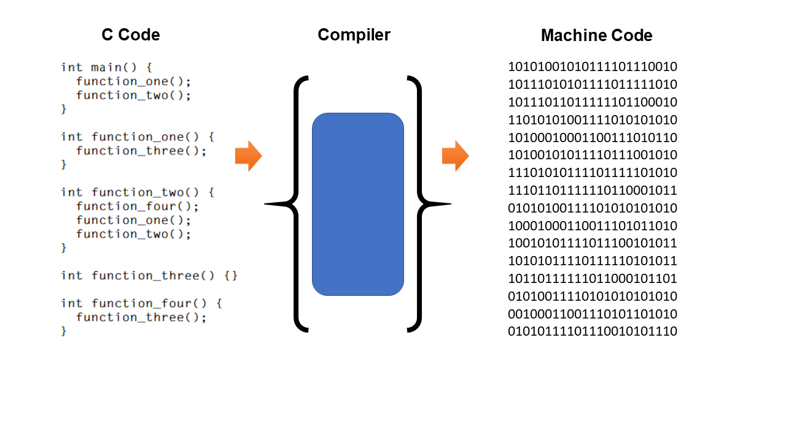
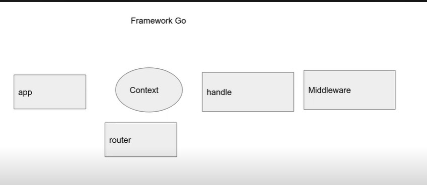

# EL PROCESO DE COMPILACIÓN
Las computadoras necesitan código de máquina, no entienden inglés ni siquiera Go. Necesitamos convertir nuestro código de alto nivel (Go) en lenguaje de máquina, que en realidad es solo un conjunto de instrucciones que un hardware específico puede entender. En tu caso, tu CPU.

El trabajo del compilador de Go es tomar el código de Go y producir código de máquina. En Windows, eso sería un .exearchivo. En Mac o Linux, sería cualquier archivo ejecutables.

### **LAS COMPUTADORAS NECESITAN CÓDIGO DE MÁQUINA**
La CPU de una computadora solo entiende su propio conjunto de instrucciones , que llamamos "código de máquina".

Las instrucciones son operaciones matemáticas básicas como sumas, restas, multiplicaciones y la capacidad de guardar datos temporalmente.

Por ejemplo, un procesador ARM usa la instrucción ADD cuando se le proporciona el número 0100en binario.

### **IR, C, RUST, ETC.**
Go, C y Rust son lenguajes en los que el compilador primero convierte el código en código de máquina antes de ejecutarlo.



### **COMPILADO VS INTERPRETADO**
Los programas compilados se pueden ejecutar sin acceso al código fuente original y sin acceso a un compilador. Por ejemplo, cuando su navegador ejecuta el código que escribe en este curso, no usa el código original, solo el resultado compilado.

Tenga en cuenta cómo esto es diferente a los lenguajes interpretados como Python y JavaScript. Con Python y JavaScript, el código es interpretado en tiempo de ejecución por un programa separado conocido como "intérprete". Distribuir código para que los usuarios lo ejecuten puede ser una molestia porque necesitan tener instalado un intérprete y necesitan acceso al código fuente original.

**EJEMPLOS DE LENGUAJES COMPILADOS**
* Ir
* C
* C++
* Óxido

**EJEMPLOS DE LENGUAJES INTERPRETADOS**
* JavaScript
* Pitón
* Rubí


# Go 

Go es un lenguaje copilado y de tipado fuerte, desarrollado por google. Cuenta con un garbege collector, es un lenguaje concurrente(se pueden realizar varias tareas a la vez).
En términos generales, los lenguajes compilados se ejecutan mucho más rápido que los lenguajes interpretados y Go no es una excepción.

Go es uno de los lenguajes de programación más rápidos, superando fácilmente a JavaScript, Python y Ruby en la mayoría de los puntos de referencia.

Sin embargo, el código de Go no se ejecuta tan rápido como sus contrapartes compiladas de Rust y C. Dicho esto, compila mucho más rápido que ellos, lo que hace que la experiencia del desarrollador sea súper productiva.

## Como iniciar un proyecto con go?

Creamos la carpeta donde vamos almacenar nuestro proyecto. Una vez hecho esto abrimos una terminal y escribimos el siguiente comando:

```bash 
go mod init github.com/Figuritx79/nombreDeLaCarpeta
```

Despues del comando init, tenemos que agregar una url unica que normalmente es el link a nuestro github. Una vez hecho esto, se nos va a crear un archivo llamado **go.mod**, en este archivo se van a listar todas las dependencias, paquetes o bibliotecas que vamos a ocupar.

## Creado nuestro proyecto

Una vez creado nuestro proyecto, vamos a escribir nuestro packege, imports y la funcion main.

```go
package main
func main{

}
```

## Importacion de librerias
Para importar una libreria, escribimos import en la parte superior y especificamos que libreria queremos: 
Siempre que vayamos a ocupar una libreria escribimos el nombre de la libreria y la funcion que queremos ocupar
```go
package main
import(
    "fmt"
    "strconv"
    "strings"
    "time"
    "github.com/gorilla/mux"
    "github.com/githubnemo/CompileDaemon"
)
func main{
    nombre := "Enrique"
    nombreDividido := strings.Split(nombre,"")

    testAtoi := "29"
    testAtoiInt,_ := strconv.Atoi(testAtoi)


	time.Sleep(1000 * time.Millisecond)
    fmt.Println(nombre)


}
```

1. Fmt: esta libreria nos permite mostrar mensajes por consola(**Println,Print,Printf,Scanln,Scan**)
2. Strconv:  proporciona funciones para convertir valores entre diferentes representaciones de cadenas y tipos numéricos.(**Atoi, Itoa**)
3. Strings: proporciona una serie de funciones para manipular y trabajar con cadenas de caracteres(Split).
4. Time : proporciona funcionalidades relacionadas con la medición y manipulación del tiempo. 
5. Mux: este paquete te permite crear tu router **go get -u github.com/gorilla/mux** con este comando traemos el modulo o paquete.
6. Daemon: este paquete permite actualizar tu servidor sin necesidad de cerrarlo y abrirlo otra vez 

## Comandos de go

1.  go run nombreDelArchivo: Este comando nos permite ejecutar el program, sin necesidad de hacer un buil del proyecto.

2. go build: Este comando nos permite crear un .exe de nuestro programa.

---

# Sintaxis del lenguaje Go 

### Variables

Para poder crear una variable hay muchas formas:

```go 
package main 

func main(){

    /* 1. */var greeting string = "Hello!"

    /* 2 */numberTwo := 20 

    /* 3 */var(
        name string = "Enrique"
        age int = 20 
        hobbie string = "Games"
    )
    /* 3.5 */ var a,b,c int
}
```

1. Declaracion explicita: En esta declaracion ocupamos la palabra reservada var y especificamos el tipo de dato e inicializamos la variable.

2. Declaración con inicialización: En esta forma de declaración, Go infiere automáticamente el tipo de la variable ***numberTwo*** basándose en el valor que se le asigna. En este caso, se declara y se inicializa ***numberTwo*** como un int con el valor 20.

3. Declaracion multiple: En esta forma de declaracion, puedes inicializar muchas varaibles de diferentes tipos(**como se ve en el ejemplo 3**) o inicializar muchas variables de un solo tipo de dato(**com se ve en el ejemplo 3.5**).

4. Hay otras formas de declarar variables. 

### Conversion de tipos de datos

Para la conversion de datos primero requerimos hacer el **import de la libreria strconv**. Una vez hecho el import hay diferente formas de conversion de datos pero por el momento solo se dos(Enteros y Strings):

1. Atoi(s string) (int, error): Esta función convierte una cadena de caracteres en un entero con signo de 32 bits. Retorna el entero convertido y un posible error si la conversión falla.

2. Itoa(i int) string: Esta función convierte un entero con signo de 32 bits en su representación de cadena de caracteres. Retorna la cadena de caracteres correspondiente.

Ejemplos: 

```go 
package main 
import(
    "fmt"
    "strconv"
)

func main(){
    /* Atoi */
    testAtoi := "29"

    testAtoiInt,_ := strconv.Atoi(testAtoi)

    fmt.Println(testAtoi)

    /* Itoa */

    testItoa := 30 

    testItoaString := strconv.Itoa(testItoa)

    fmt.Println(testItoaString)
}
```

Una cosa que debo explicar el _ en el Atoi pero para eso necesitamos explicar como funciona. Como ya explicamos anteriormete, el Atoi convierte  una cadena a un entero. Cuando se convierte retorna dos valores, el primero es el entero convertido y el segundo es un posible error, y este error puede dar problemas en ejecucion si no lo ocupamos para eso empleamos el ***_*** para que ignore el error. Un punto a recalcar es que si necesitas guardar el error lo puedes hacer  con err como se muestra en el siguiente ejemplo: 

```go 
 testAtoi := "29"

    testAtoiInt,err := strconv.Atoi(testAtoi)

    fmt.Println(testAtoi)

```


### Salida de datos
En Go, hay varias formas de imprimir valores en la consola y las tres funciones más comunes son **Println, Print y Printf**: 

1. Println: se utiliza para imprimir valores en la consola, seguidos de un salto de línea. 
```go 
package main

import "fmt"

func main() {
    fmt.Println("Hola, mundo!")
    fmt.Println(42)
    fmt.Println(3.14159)
}
/* 
Salida: 

Hola, Mundo!
42
3.1416
*/
```

2. Print: se utiliza para imprimir valores en la consola sin agregar un salto de línea al final. d
```go 
package main

import "fmt"

func main() {
    fmt.Print("Hola, ")
    fmt.Print("mundo!")
    fmt.Print(42)
    fmt.Print(3.14159)
}
/* 
Salida 

Hola, mundo!423.14159
*/
```

3. Printf: se utiliza para imprimir valores con un formato específico. Puedes usar verbos de formato para especificar cómo se debe formatear cada valor.
```go 
package main

import "fmt"

func main() {
    name := "John"
    age := 25
    height := 1.75

    fmt.Printf("Nombre: %s, Edad: %d, Altura: %.2f metros\n", name, age, height)
}
/* 
Salida:

Nombre: John, Edad: 25, Altura: 1.75 metros
*/
```
* %s: Se utiliza para cadenas 
* %d: se utiliza para enteros
* $f: Se utiliza para flotantes o decimales

## Entrada de datos 

En Go, las funciones Scan y Scanln se utilizan para leer la entrada del usuario desde la consola. Ambas funciones son parte del paquete fmt. 

1. Scan: La función Scan se utiliza para leer la entrada del usuario hasta encontrar un espacio en blanco (espacio, tabulación o salto de línea). Los valores leídos se asignan a las variables proporcionadas. 

```go 
package main

import "fmt"

func main() {
    var name string
    var age int

    fmt.Println("Ingrese su nombre:")
    fmt.Scan(&name)

    fmt.Println("Ingrese su edad:")
    fmt.Scan(&age)

    fmt.Printf("Nombre: %s, Edad: %d\n", name, age)
}

/* 
Salida: 
Ingrese su nombre:
John Doe
Ingrese su edad:
30
Nombre: John, Edad: 30

*/
```

2. Scanln: La función Scanln se utiliza para leer la entrada del usuario hasta encontrar un salto de línea. Los valores leídos se asignan a las variables proporcionadas. 

```go 
package main

import "fmt"

func main() {
    var name string
    var age int

    fmt.Println("Ingrese su nombre y edad:")
    fmt.Scanln(&name, &age)

    fmt.Printf("Nombre: %s, Edad: %d\n", name, age)
}

/* 
Salida:
Ingrese su nombre y edad:
John Doe 30
Nombre: John Doe, Edad: 30

*/
```

## Condicion If 

La sintaxis de un if la siguiente: 

```go 
package main

import (
	"fmt"
	/* "strconv"  */)

func main() {

	var (
		number int
	)

	fmt.Println("Introduce un numero")
	fmt.Scanln(&number)

	if number%2 == 0 {
		fmt.Println(number,"El numero es par")
	} else {
		fmt.Println(number,"El numero es impar")
	}
	if number == 0 {
		fmt.Println(number,"El numero es cero")
	}
}
```

## Arreglos

Son una colección de elementos del mismo tipo que se almacenan en una secuencia contigua en la memoria. Cada elemento en el arreglo se identifica por su índice, que comienza en cero. Las diferentes formas de declarar un arreglos son: 

```go 
package main 

import("fmt")

func main(){
    /* 1 */
    var ages [3]int
	fmt.Println(ages[0])
	fmt.Println("El tamano del arreglos es de: ", len(ages))

    /* 2 */
    var lenguages = [3]string{"Php", "Go", "Java"}
	fmt.Println(lenguages)

    /* 3 */
    agesTwo := [3]int{6, 31, 9}
	fmt.Println(agesTwo)
}
```

Al momento de hacer una asignacion de un arreglo tenemos que fijarnos que sean de la misma longitud, ya que a pesar de que son arreglos no serian del mismo tipo. Tambien se puede hacer comparaciones con los arreglos de la siguiente forma: 

```go
package main 

import ("fmt")

func main(){
    arrayOne := [3]int{1, 2, 3}
	arrayTwo := [3]int{1, 2, 3}
	arrayThree := [3]int{2, 3, 4}

	fmt.Println(arrayOne == arrayTwo, arrayOne == arrayThree, arrayTwo == arrayThree)
    /* Salida
        True,false,false 
    */
}
```

Al hacer la comparacion tienene que ser de la misma longitud porque sino va a dar error

## Len()

Len es una funcion para medir la longitud de diferentes tipos de datos como slide, arrays, maps  y canales. Ejemplo:

```go 
package main 
import ("fmt)

func main(){
    ages := [3]int{4,5,5}

    fmt.Println("La longitud del arreglos es: ", leng(ages))
}
```


## Slices 

Los slice en go, son arreglos pero sin definir la longitud de ellos. Normalmete si no se inicialza el slide, su valor va a ser nil(osea vacio o null).

La estructura de los slides contiene 3 datos:
1. Un puntero al arreglo. 
2. Longitud al arreglo al que apunta 
3. Su capacidad

```go 
package main 
import(
    "fmt"
)
func main(){
    var matriz int[] = []int{1,2,3}

    fmt.Println(matriz)
    fmt.Println("Len =",len(matriz))
/* Salida
{1,2,3}
len = 3 
*/
    var matrizNil int[] 

    if matrizNil == nil{
        fmt.Println("Esta vacio")

    }else{
        fmt.Println(matrizNil)
    }
}
```

Tambien los slides te permiten hacer una operacion conocida como **slicing**: El slicing en Go es una operación que te permite crear una vista o subarreglo de un arreglo existente. En lugar de copiar los elementos a un nuevo arreglo, el slicing simplemente crea una referencia al segmento deseado del arreglo original. Esto hace que el slicing sea eficiente en términos de memoria y rendimiento.

El slicing se realiza utilizando la sintaxis arreglo[inicio:fin], donde inicio es el índice de inicio del segmento (incluido) y fin es el índice de finalización (excluido). Es decir, el segmento resultante incluirá los elementos desde el índice inicio hasta el índice anterior a fin.

```go 
package main 
import(
    "fmt"
)
func main(){
    var arreglo [3]int =  [3]int{1,2,3}

    slice := arreglo[1:3]

    fmt.Println(slice)

    /* Salida
        {2,3}
    */
}


```

## Funcion copy()
En Go, la función copy se utiliza para copiar elementos de un slice a otro.La sintaxis de la función copy es la siguiente:

```go 
copy(destino,fuente)
```
donde destino  es el slice de destino al que se copiarán los elementos y fuente es el slice fuente desde el cual se copiarán los elementos.

```go 
package main 

import(
    "fmt"
)

func main(){
    slice := []int{1,2,3,4}
    copySlice := make([]int,len(slice))

    copy(copySlice,slice)
}

```
Es recomendable utilizar la funcion len cuando utilizemos copy para asegurarse que se copien todos los elemnentos del slice.

## Funcion append()

En Go, la función append se utiliza para agregar elementos a un slice existente. La sintaxis de la función append es la siguiente:

```go 
append(slice , elements )
```
donde slice es el slice al que se agregarán los elementos y elements son los elementos que se desean agregar al slice. 

La función append devuelve un nuevo slice que contiene todos los elementos del slice original más los elementos agregados. Si el slice original tiene suficiente capacidad para acomodar los nuevos elementos, el slice resultante se ampliará y los nuevos elementos se agregarán al final. Si el slice original no tiene suficiente capacidad, se creará un nuevo slice con una capacidad mayor y los elementos se copiarán al nuevo slice.

```go 
package main
import("fmt")

func main(){
    slice := []int{1,2,3,4,5,6}

    newSlice := append(slice,7,8,9)
    fmt.Println(newSlice)

}
```

## Funcion cap()

En Go, la función cap() se utiliza para obtener la capacidad de un slice. La capacidad de un slice es la cantidad máxima de elementos que puede contener sin necesidad de asignar más memoria. 


```go 
package main

import "fmt"

func main() {
    slice := make([]int, 5, 10)
    fmt.Println("Longitud:", len(slice))
    fmt.Println("Capacidad:", cap(slice))
}

```
En este caso, el slice tiene una longitud de 5 y una capacidad de 10. Esto significa que el slice actualmente contiene 5 elementos y puede contener hasta 10 elementos sin necesidad de asignar más memoria.


## Punteros en Go

En programación, un puntero es una variable especial que almacena la dirección de memoria de otra variable o dato en un programa. En otras palabras, un puntero es una variable que "apunta" a otra ubicación de memoria.

Cuando se declara un puntero en un lenguaje de programación, se reserva un espacio en memoria para almacenar una dirección. Luego, el puntero puede ser utilizado para acceder y manipular el valor almacenado en esa dirección de memoria, o para acceder a otras direcciones relacionadas.

En Go, los punteros se utilizan principalmente para permitir la modificación de valores de variables en función de su dirección de memoria. Para declarar un puntero en Go, se utiliza el tipo de dato seguido del símbolo de asterisco (*).

```go 
var x int              // Declara una variable entera
var p *int             // Declara un puntero a un entero

x = 42                // Asigna un valor a la variable entera
p = &x                // Asigna la dirección de memoria de 'x' al puntero

fmt.Println(*p)       // Imprime el valor al que apunta el puntero ('42')

```

En el ejemplo anterior, p es un puntero a un entero (*int), y se inicializa con la dirección de memoria de la variable x utilizando el operador &. Luego, para acceder al valor al que apunta el puntero, se utiliza el operador *. En este caso, *p devuelve el valor 42.

## Struct and interface 
**funcion new**
Para poder modificar los datos de un stuct ya creada necesitamos crear un funcion que sea un puntero de la clase
```go 
package main
import(
    "fmt"
)
type Personaje interface {
	Ataque() int
	Defensa() int
}

type Mago struct {
	fuerza  int
	stamina int
}

func (M Mago) Ataque() int {
	return M.fuerza
}

func (M Mago) Defensa() int {
	return M.stamina

}
func personajeHabilidad(personaje Personaje) {
	fmt.Println(personaje.Ataque())
	fmt.Println(personaje.Defensa())
}

func main(){

    wizard := Mago{
		fuerza:  10,
		stamina: 5,
	}
	personajeHabilidad(wizard)
	fmt.Println("El area del triangulo es: ")
}
```

## Programacion sincrono, asincronas y concuurrente

1. Sincrono: se refiere a un estilo de ejecución en el que las tareas se realizan de manera secuencial y se espera a que una tarea se complete antes de pasar a la siguiente. En otras palabras, las operaciones se ejecutan en un orden predeterminado y se bloquean hasta que se completa cada tarea antes de avanzar a la siguiente.

2. Asíncrono: Se refiere a la capacidad de realizar tareas de forma independiente y no bloqueante, lo que significa que una tarea puede iniciar una operación y continuar con otras tareas sin tener que esperar la finalización de la operación en curso. El enfoque asíncrono se utiliza comúnmente para operaciones que pueden tomar tiempo, como solicitudes de red o lecturas/escrituras en disco. En lugar de bloquear la ejecución, se utiliza algún mecanismo (como devoluciones de llamada o promesas) para manejar la finalización de la tarea y continuar con otras operaciones.

3. Concurrente: Se refiere a la capacidad de realizar múltiples tareas al mismo tiempo. En un entorno concurrente, varias tareas pueden ejecutarse simultáneamente, ya sea utilizando múltiples hilos de ejecución, procesos o goroutines, dependiendo del lenguaje o entorno de programación. La concurrencia se utiliza para aprovechar el paralelismo y mejorar el rendimiento y la capacidad de respuesta del programa.

## Gorutine

Las goroutines son una característica clave del lenguaje de programación Go. Una goroutine es una función ligera que se ejecuta de forma concurrente junto con otras goroutines dentro de un programa Go. A diferencia de los hilos tradicionales, las goroutines son administradas por el propio runtime de Go en lugar del sistema operativo.

Las goroutines permiten que un programa Go realice operaciones concurrentes de manera eficiente y concisa. En lugar de crear hilos múltiples, que pueden ser costosos en términos de recursos y rendimiento, se pueden utilizar goroutines para ejecutar múltiples tareas en paralelo dentro de un único hilo de ejecución.

```go 
package main 

import("fmt")
func main() {
    go imprimirMensaje("Hola")
    imprimirMensaje("Mundo")
}

func imprimirMensaje(mensaje string) {
    fmt.Println(mensaje)
}

```

## gorutine con Channels


## Sintaxis del for
1. 
```go
for i := 1; i <= 10; i++ {
    fmt.Println(i)
}

```

2. 
```go 
slice := []int{1, 2, 3, 4, 5}
for index, value := range slice {
    fmt.Printf("Índice: %d, Valor: %d\n", index, value)
}

``` 
En el último ejemplo, la palabra clave range se utiliza para iterar sobre los elementos de un slice. En cada iteración, el valor del índice y el valor del elemento se asignan a las variables index y value, respectivamente.


## Servidor en go y frameworks web
Explicar luego, handler que es?, mux etc



* App: Esta levanta el servidor 
* Contexto: Contiene toda la peticion y la respuesta a dicha peticion
* Router: Este en ruta la que quiere hacer el cliente
* Handle:  Este Resuelve la peticion 
* Middleware: Es una funcion antes que haces revisiones, validaciones y que corta el flujo si es necesario


```go 

package main

import (
	"fmt"
	"io"
	"log"
	"net/http"
	"os"
)

func handler(w http.ResponseWriter, r *http.Request) {
	http.ServeFile(w, r, "./index.html")
}

func uploader(w http.ResponseWriter, r *http.Request) {
	r.ParseMultipartForm(2000)
	file, fileInfo, err := r.FormFile("archivo")

	f, err := os.OpenFile("./files/"+fileInfo.Filename, os.O_WRONLY|os.O_CREATE, 0666)
	if err != nil {
		log.Fatal(err)
		return
	}
	defer f.Close()
	io.Copy(f, file)
	fmt.Fprintf(w, fileInfo.Filename)
}

func about(w http.ResponseWriter, r *http.Request) {

}
func main() {

	http.HandleFunc("/", handler)
	http.HandleFunc("/about", about)
	http.HandleFunc("/files", uploader)
	http.ListenAndServe(":3000", nil)

}

```

## Protocolo http 
El protocolo de transferencia de hipertexto es un protocolo de comunicación utilizado para la transferencia de información en la web. Es la forma de comunicar al cliente con el servidor, el cliente hace una peticion(**Request**) y el servidor realiza una respuesta(**Response**) a dicha peticion.

#### Partes de una Request
Una request tiene o cuenta con una serie de partes, donde cada una cumple una funcionalidad distinta respecto a la transmision del mensaje del cliente al servidor. 

1. Método: Especifica la acción que se desea realizar en el recurso solicitado. Algunos de los métodos más comunes son:

 * GET: Obtener un recurso.
 * POST: Enviar datos al servidor para ser procesados.
 * PUT: Actualizar un recurso existente.
 * DELETE: Eliminar un recurso.

2. URL (Uniform Resource Locator): Especifica la dirección del recurso que se desea obtener o manipular. La URL consta de diferentes partes, incluyendo el esquema (por ejemplo, "http://" o "https://"), el nombre de dominio y la ruta al recurso específico.

3. Encabezados (Headers): Son metadatos que proporcionan información adicional sobre la solicitud. Los encabezados pueden incluir información sobre el tipo de contenido aceptado por el cliente, autenticación, cookies, tipo de compresión, entre otros.

4. Cuerpo (Body): Es opcional y se utiliza para enviar datos adicionales en la solicitud, como los parámetros de un formulario HTML o los datos JSON en una solicitud POST. El cuerpo es comúnmente utilizado en solicitudes POST, PUT y PATCH.


## Partes de una Response y sus status

## Delete, Get, Post, Put, Push


## Cookies


## Error al querer utilizar un paquete 

El dia de hoy 16/06/23 tuve un problema al momento de querer utilizar el paquete CompileDaemon. Este error consistia en que no me dejaba ejecutar un comando relacionado con CompileDaemon, para solucionar este problema vas a ir a la siguiente url

```sh
C:\Users\gonhe_c8jlubo\go\pkg\mod\github.com
```
En esta url vas a buscar el paquete del respositorio y vas a ejecutar **go install** dentro de la carpeta del paquete 